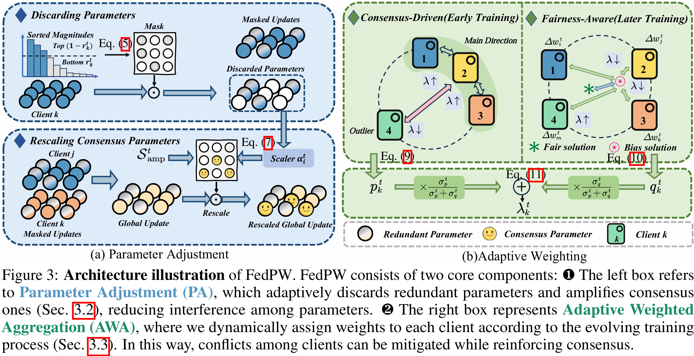

<h1 align="center">Rethinking Fair Federated Learning from  <br>Parameter and Client View </h1>

<p align="center"><em>Kaiqi Guan&dagger;, Wenke Huang&dagger;, Xianda Guo, Yueyang Yuan, Bin Yang, Mang Ye*</em></p>

<div align="center">

</div>

<h2> 🙌 Abstract </h2>
Federated Learning is a promising technique that enables collaborative machine learning while preserving participant privacy. With respect to multi-party collaboration, achieving performance fairness acts as a critical challenge in federated systems. Existing explorations mainly focus on considering all parameter-wise fairness and consistently protecting weak clients to achieve performance fairness in federation. However, these approaches neglect two critical issues. 1) Parameter Redundancy: Redundant parameters that are unnecessary for fairness training may conflict with critical parameters update, thereby leading to performance degradation. 2) Persistent Protection: Current fairness mechanisms persistently enhance weak clients throughout the entire training cycle, hindering global optimization and causing lower performance alongside unfairness. To address these, we propose a strategy with two key components: First, parameter adjustment with mask and rescale which discarding redundant parameter and highlight critical ones, preserving key parameter updates and decrease conflict. Second, we observe that the federated training process exhibits distinct characteristics across different phases. We propose a dynamic aggregation strategy that adaptively weights clients based on local update directions and performance variations. Empirical results on single-domain and cross-domain scenarios demonstrate the effectiveness of the proposed solution and the efficiency of crucial modules.


<h2 id="citation"> 🥳 Citation </h2>

Please kindly cite this paper in your publications if it helps your research:

```bibtex
@inproceedings{FedPW_NeurIPS25,
  title={Rethinking Fair Federated Learning from Parameter and Client View},
  author={Guan, Kaiqi and Huang, Wenke and Guo, Xianda and Yuan, Yueyang and Yang, Bin and Ye, Mang},
  booktitle={NeurIPS},
  year={2025}
}
```